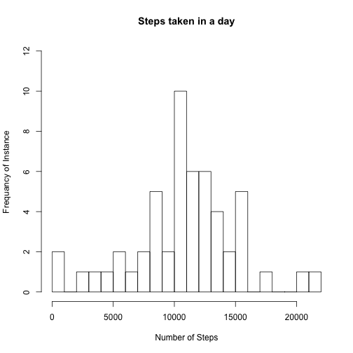
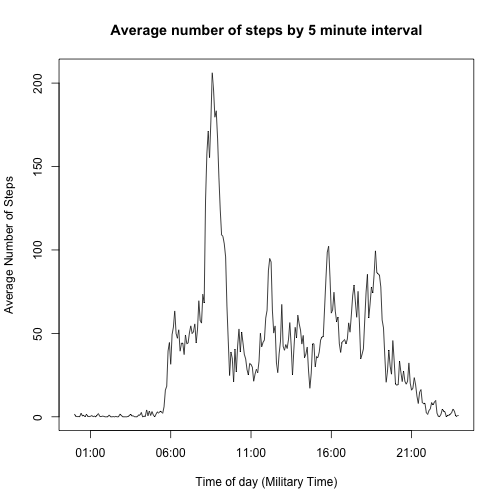

2 month step study (Single Subject)
----------------------------------------

For details on the study please visit: [Cousera Reproducible Research](https://class.coursera.org/repdata-012/human_grading/view/courses/973513/assessments/3/submissions)

Summary of data variables:
- *steps* : Number of steps taking in a 5-minute interval (missing values are coded as NA)
- *date* : The date on which the measurement was taken in YYYY-MM-DD format
- *interval* : Identifier for the 5-minute interval in which measurement was taken

In this document, the questions will be asked in **bolded** text. The outcome of the inquery will be displayed below the question and associated code chuncks.

First we'll load the data into memory and set a working directory. This is an example from a local machine. Data can be accaesed from the "Cousera Reproducible Research" link above.


```r
setwd("/Users/petersali/Data_Science/Johns_Hopkins/5_Reproducible_Research/Assigment_1")
data <- read.csv('activity.csv')
```

### What is the distribution of the count of total steps by day for the 61 days in the study for the subject?

*NOTE*: days with no data were removed from this data.


```r
## Split the data by date
split_steps <- split(data$steps, data$date)

## Sum the data by day
steps_by_day <- rowSums(do.call(rbind, split_steps), na.rm = TRUE)

## Convert the named num data type to data frame
steps_by_day_df <- data.frame(Date=names(steps_by_day), steps=steps_by_day, row.names=NULL)

## Remove the days with no data
steps_no_na <- steps_by_day_df[-c(1, 8, 32, 35, 40, 41, 45, 61), ] 
```

**The histogram below shows the distribution of total steps for each day.**


```r
steps_by_day_hist <- hist(steps_no_na$steps, breaks = 25, 
main="Steps taken in a day",
xlab="Number of Steps", ylab="Frequancy of Instance", ylim=c(0,12))
```

 

### What is the mean and median steps per day in the data set?

NOTE: The mean and median values were calculated based on only days that had data provided.


```r
steps_mean <- sum(steps_no_na$steps, na.rm=TRUE) / nrow(steps_no_na)
```


```
## Mean Steps per day: 10766.19
```


```r
steps_median <- median(steps_no_na$steps)
```


```
## Median steps value: 10765
```

### What is the average number of steps over the 2 month period by 5 minute interval?

The code below ceates a data set (data frame) with time intervals and mean steps by interval.


```r
ave_by_interval <- colMeans(do.call(rbind, split_steps), na.rm = TRUE)

minutes_in_day <- data$interval[1:288]

ave_steps_by_interval <- data.frame("Time" = minutes_in_day, "Average_Steps" = ave_by_interval)

## Credit: https://class.coursera.org/repdata-012/forum/thread?thread_id=36
## Ray Jones
intervals <- strptime(sprintf("%04d", as.numeric(ave_steps_by_interval$Time)), format="%H%M")
```

**Time series plot of average steps across all days for given 5 minue interval:**


```r
plot(intervals, ave_steps_by_interval$Average_Steps, type="l", 
xlab= "Time of day (Military Time)", ylab= "Average Number of Steps", col="black" , lwd=1, 
main = "Average number of steps by 5 minute interval")
```

 

### What was the 5 minute interval in which the most steps were taken?


```r
ordered_interval <- ave_steps_by_interval[order(ave_steps_by_interval$Average_Steps), ]
```


```
## The 5 minute interval that contains the most steps is at 835 am with 206.1698 steps
```
### What is the total number of missing values?

```r
total_na_calc <- sapply(data, function(x) sum(is.na(x)))
total_na_steps <- as.integer(total_na_calc[1])
```

```
## The total number of missing values in the data set is 2304 .
```

### What impact does missing values vs. imputing missing values based on averages by time interval have?

Instead of completely removing missing (NA) values, the manipulation in the code below takes the mean of the 5 minute interval over the 61 day period and assigns that value to any NA values in that interval. The chart below exhibits how this affects the data.


```r
## Repeat the average interval over all 61 days
ave_by_interval_all_days <- rep(ave_by_interval, times = 61, length.out = NA, each = 1)

## Add the repeating average vector to the original data set and create a new data frame
data_no_na <- transform(data, Average_Steps = ave_by_interval_all_days)

## Round the averages to create integers
data_no_na$Average_Steps <- round(data_no_na$Average_Steps)

## Create a new dataset that is equal to the original dataset but with the missing data filled in.
## Replace the NA steps with the average for that interval
data_no_na$steps[is.na(data_no_na$steps)] <- as.integer(data_no_na$Average_Steps[is.na(data_no_na$steps)])

## Manipulate the data
split_steps_no_na <- split(data_no_na$steps, data_no_na$date)
steps_by_day_no_na <- rowSums(do.call(rbind, split_steps_no_na), na.rm = TRUE)
steps_by_day_df_no_na <- data.frame(Date=names(steps_by_day_no_na), 
steps=steps_by_day_no_na, row.names=NULL)

no_na_compare_df <- data.frame(No_NA = steps_by_day_df_no_na$steps, With_NA = steps_by_day_df$steps)
```


```r
require(plotrix)
```


```r
colors = c("blue", "green")
multhist(no_na_compare_df, breaks = 10,
  right=FALSE,
	col=colors,
	main="Compare NA's to no NA's",
	xlab="Average Number of Steps per day",
	ylab ="Number of Instances")
legend("topright", c("No NA", "NA's included"), col=colors, lwd=10)
```

 

We can see that imputing mean values to NA's increases the number of instances within the 10-11K range and decreases the instances in the 1K range. Barring for circumstances such as sickness, this seems to match more closely the reality for a person willing to be monitored. 

*NOTE*: It would be beneficial to have more data the following: was the person sick at all during the study? Was the person on vacation at all during the study.


### Is there any difference between weekdays and weekends on the mean steps taken for each 5 minute interval?

The first step is to create a data set that contains a columns that delinations for weekday vs. weekend.


```r
library(chron)
```


```r
## Make a vector with date type "date" (not factor)
wk_day <- as.Date(data_no_na$date)

## make a vector that tests for weekend/weekday
wk_day_bool <- is.weekend(wk_day)

## Make a copy of data_no_na
data_no_na_copy <- data_no_na

## Make a new data frame and add the weekday bool column
weekday_data <- transform(data_no_na_copy, 'Weekday' = wk_day_bool)

## Remove un-needed columns
weekday_data_simp <- weekday_data[, -c(2, 4)] 

## Aggregate data by interval and weekday vs. Weekend
agg_weekday <- aggregate(weekday_data_simp, by=list(weekday_data_simp$interval,
weekday_data_simp$Weekday), FUN=mean)

## Remove un-needed columns created by aggreagte()
agg_weekday_simp <- agg_weekday[, -c(1, 5)] 

## Change Group.2 name to Weekend
names(agg_weekday_simp)[names(agg_weekday_simp)=="Group.2"] <- "Weekend"

## I did not use the code below as it set a specific date. The intervaled data has
## The unexpected hourly "dips" in it's current state
## agg_weekday_simp$time <- strptime(sprintf("%04d", as.numeric(agg_weekday_simp$interval)), 
## format="%H%M")
```

**Plot the weekend vs. weekday data for average steps by interval.**

NOTE: This is a boolean (TRUE/FALSE) comparison that tests for "weekend" which is TRUE (weekday is FALSE).


```r
require(ggplot2)
```


```r
ggplot(agg_weekday_simp, aes(x = interval, y = steps, group = Weekend)) +
  geom_line(size=.75) +
	facet_grid(Weekend ~ .) +
	labs(title="Steps by 5 minute interval - FALSE = Weekday, TRUE = Weekend")
```

 

